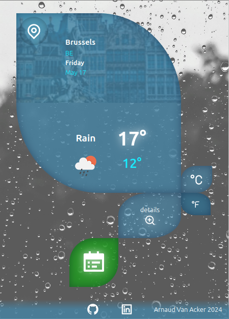

# Weather App



## Description
Weather App est une application web qui fournit des informations météorologiques en temps réel pour n'importe quelle ville dans le monde. L'application utilise les technologies HTML5, CSS3, JavaScript, SASS et Chart.js pour offrir une interface utilisateur moderne et interactive. Les données météorologiques sont fournies par l'API OpenWeather, et les images de fond dynamiques sont tirées de l'API Unsplash.

## Fonctionnalités
- Recherche de la météo par ville
- Affichage des conditions météorologiques actuelles (température, humidité, etc.)
- Graphiques des prévisions météorologiques
- Images de fond dynamiques correspondant aux conditions météorologiques
- Interface utilisateur réactive et esthétique

## Technologies Utilisées
- **HTML5** : Structure de base de l'application
- **CSS3** : Stylisation de l'interface utilisateur
- **JavaScript** : Logique de l'application et manipulation du DOM
- **SASS** : Préprocesseur CSS pour des styles plus organisés et modulaires
- **Chart.js** : Bibliothèque pour créer des graphiques interactifs des prévisions météorologiques
- **OpenWeather API** : Source des données météorologiques
- **Unsplash API** : Source des images de fond dynamiques

## Installation
1. Clonez le dépôt :
   ```bash
   git clone https://github.com/votre-utilisateur/weather-app.git
